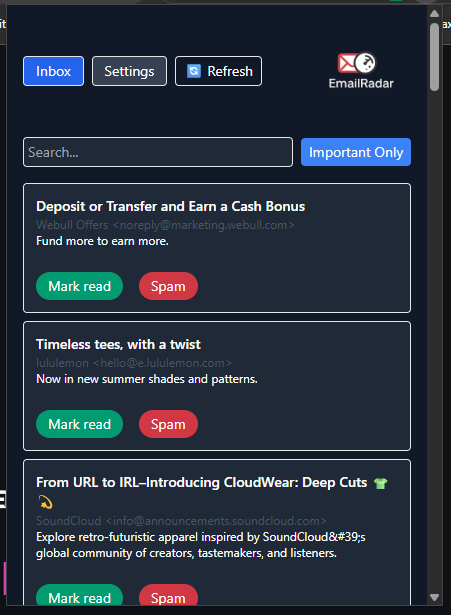
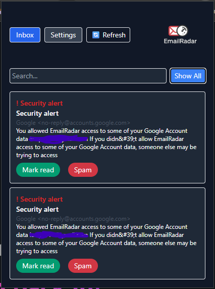

# EmailRadar — AI-Powered Gmail Triage Extension

EmailRadar is a modern Gmail browser extension that uses OpenAI (ChatGPT) to intelligently detect and highlight **important emails** (job leads, bills, security alerts, personal contacts, etc.) — so you never miss things that matter.

It filters the noise from your inbox, surfaces what’s important, and lets you take action (mark as read, spam) right from the popup.

---

## ✨ Features

- 🔍 **AI-based email importance detection** (GPT-3.5-Turbo)
- 📬 Inbox view with **“Important Only”** toggle and search
- 🔒 **Privacy-first** settings — option to classify using just **subject/from** *(no snippet!)* by default
- 🔁 **Manual refresh**, pagination & dark mode support
- ⚙️ Settings page with batch size, default filters, theme
- 📩 Actions: **Mark as read / Spam** (updates Gmail via API)
- 🧠 **Caching** to reduce AI API usage and improve speed

---

## 📸 Screenshots

| Inbox View (All)                | Important Only Toggle           |
|--------------------------------|---------------------------------|
|      |    |

| Settings Popup                 | Extension Options Page          |
|--------------------------------|---------------------------------|
|   |      |


---

## 🛠️ Setup / Development

### 1. Clone

```bash
git clone https://github.com/YOUR_USERNAME/emailradar.git
cd emailradar
```

### 2. Build

```bash
npm install
npm run build
```

### 3. Load into Chrome

- 1. Go to chrome://extensions
- 2. Enable Developer mode
- 3. Click Load unpacked
- 4. Select the /dist folder


## 🔧 Settings

Before using, open the Options Page and paste your OpenAI API key.

Optional: enable “Include snippet in AI classification” for more accurate results (uses email preview)
